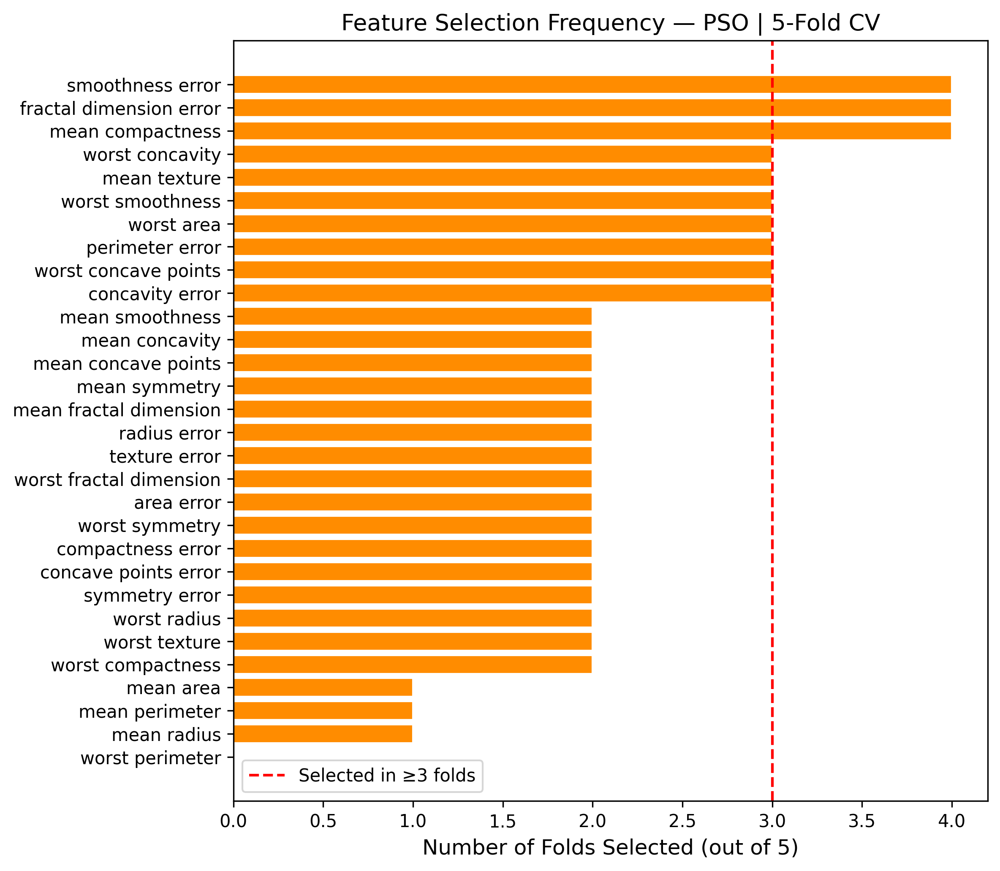
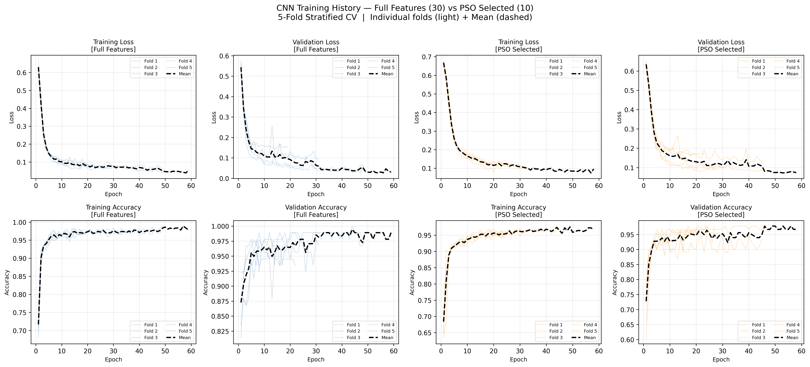
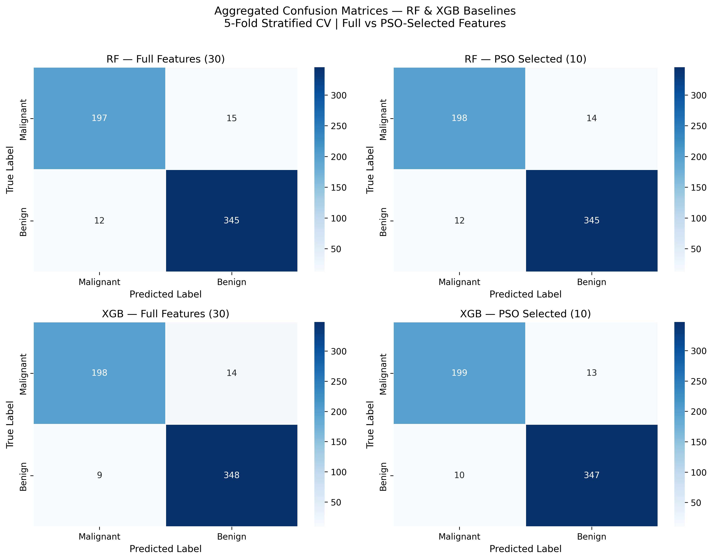
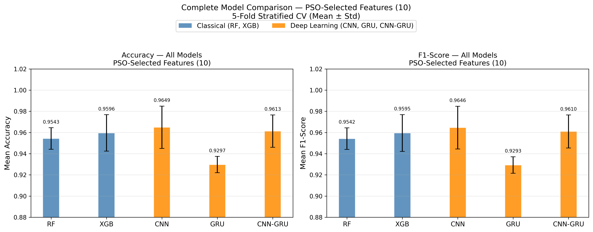

# Impact of Metaheuristic-Based Feature Selection on the Performance of Deep Learning Models for Breast Cancer Classification

Implementation accompanying the manuscript:

**Impact of Metaheuristic-Based Feature Selection on the Performance of Deep Learning Models for Breast Cancer Classification**

Submitted to *Scientific Reports*.

# Table of Contents

- Overview
- Methods
- Repository Structure
- Dataset
- Requirements
- Running the Experiments
- Experimental Evaluation
- Reproducibility
- Citation
- License

# 1. Overview

This repository contains the Python implementation of the experiments presented in the manuscript:

**"Impact of Metaheuristic-Based Feature Selection on the Performance of Deep Learning Models for Breast Cancer Classification"**

The project investigates the impact of wrapper-based metaheuristic feature selection methods on machine learning and deep learning models for breast cancer classification.

The implemented framework evaluates the effectiveness of **Particle Swarm Optimization (PSO)** and **Ant Colony Optimization (ACO)** for selecting relevant features from the Breast Cancer Wisconsin Diagnostic (BCWD) dataset and analyzes their influence on classification performance.

The selected feature subsets are evaluated using traditional machine learning models and deep learning architectures, including Random Forest, XGBoost, Convolutional Neural Networks (CNN), Gated Recurrent Units (GRU), and hybrid CNN-GRU models.

---

# 2. Methods

The repository implements the following approaches:

## Feature Selection Methods

- Particle Swarm Optimization (PSO)
- Ant Colony Optimization (ACO)

Both methods are implemented as wrapper-based feature selection approaches, where candidate feature subsets are evaluated according to classifier performance.

## Machine Learning Baselines

- Random Forest (RF)
- XGBoost (XGB)

## Deep Learning Models

- Convolutional Neural Network (CNN)
- Gated Recurrent Unit (GRU)
- Hybrid CNN-GRU architecture

The experiments compare model performance before and after metaheuristic-based feature selection.

---

# 3. Repository Structure
```bash
BreastCancer_Metaheuristic_DL/
│
├── Baselines/
│   ├── baseline_rf_xgb_classification.py
│   └── RF_XGB_5FOLD_RESULTS/
│       ├── figures/
│       ├── RF/
│       │   ├── Full_Features/
│       │   │   └── fold_1/ ... fold_5/
│       │   └── PSO_Selected/
│       │       └── fold_1/ ... fold_5/
│       ├── XGB/
│       │   ├── Full_Features/
│       │   │   └── fold_1/ ... fold_5/
│       │   └── PSO_Selected/
│       │       └── fold_1/ ... fold_5/
│       └── baseline_5fold_results.csv
│
├── FeatureSelection/
│   ├── pso_rf_feature_selection.py
│   ├── aco_rf_feature_selection.py
│   ├── PSO_RF_5FOLD_RESULTS/
│   │   ├── figures/
│   │   ├── fold_1/ ... fold_5/
│   │   ├── pso_convergence_curves.csv
│   │   ├── pso_rf_5fold_results.csv
│   │   └── pso_rf_5fold_summary.csv
│   └── ACO_RF_5FOLD_RESULTS/
│       ├── figures/
│       ├── fold_1/ ... fold_5/
│       ├── aco_convergence_curves.csv
│       ├── aco_rf_5fold_results.csv
│       └── aco_rf_5fold_summary.csv
│
├── DeepLearning/
│   ├── cnn_pso_classification.py
│   ├── gru_pso_classification.py
│   ├── cnn_gru_pso_classification.py
│   │
│   ├── CNN_5FOLD_RESULTS/
│   │   ├── figures/
│   │   ├── Full_Features/
│   │   │   └── fold_1/ ... fold_5/
│   │   ├── PSO_Selected/
│   │   │   └── fold_1/ ... fold_5/
│   │   └── cnn_5fold_results.csv
│   │
│   ├── GRU_5FOLD_RESULTS/
│   │   ├── figures/
│   │   ├── Full_Features/
│   │   │   └── fold_1/ ... fold_5/
│   │   ├── PSO_Selected/
│   │   │   └── fold_1/ ... fold_5/
│   │   └── gru_5fold_results.csv
│   │
│   └── CNNGRU_5FOLD_RESULTS/
│       ├── figures/
│       ├── Full_Features/
│       │   └── fold_1/ ... fold_5/
│       ├── PSO_Selected/
│       │   └── fold_1/ ... fold_5/
│       └── cnngru_5fold_results.csv
│
├── docs/
│   ├── all_models_comparison.png
│   ├── baseline_confusion_matrices.png
│   ├── cnn_training_history_combined.png
│   └── pso_feature_frequency.png
│
├── requirements.txt
├── README.md
├── LICENSE
├── CITATION.cff
└── .gitignore
```

---

# 4. Dataset

The experiments use the **Breast Cancer Wisconsin Diagnostic (BCWD)** dataset, available through the `scikit-learn` library.

The dataset contains numerical features extracted from digitized images of fine needle aspirate (FNA) samples of breast masses. The classification task is binary:

- **Malignant tumors**
- **Benign tumors**

### Dataset Characteristics

| Property | Value   |
|----------|--------:|
| Samples  | **569** |
| Features | **30**  |
| Classes  | **2**   |
| Malignant| **212** |
| Benign   | **357** |

All experiments use the same dataset, identical train/test splits generated by **5-fold stratified cross-validation**, and identical preprocessing to ensure fair comparison between feature selection methods, classical machine learning baselines, and deep learning models.

---

# 5. Requirements

The experiments were implemented using **Python 3.10**.

The required Python packages and versions are provided in:


requirements.txt


Install dependencies using:

```bash
pip install -r requirements.txt

```

Main dependencies include:

numpy==1.24.3
pandas==2.0.3
scikit-learn==1.3.2
scipy==1.10.1
tensorflow==2.12.0
xgboost==3.2.0
matplotlib==3.7.2
seaborn==0.12.2

---

# 6. Running Experiments

Each experiment can be executed independently.

## Feature Selection

### PSO-based feature selection

```bash
python FeatureSelection/pso_rf_feature_selection.py
```

### ACO-based feature selection

```bash
python FeatureSelection/aco_rf_feature_selection.py
```

---

## Classical Machine Learning Baselines

### Random Forest and XGBoost Baselines

```bash
python Baselines/baseline_rf_xgb_classification.py
```

---

## Deep Learning Models

### CNN

```bash
python DeepLearning/cnn_pso_classification.py
```

### GRU

```bash
python DeepLearning/gru_pso_classification.py
```

### CNN-GRU

```bash
python DeepLearning/cnn_gru_pso_classification.py
```

---

# 7. Experimental Evaluation

All experiments follow a consistent evaluation protocol to ensure fair comparison between feature selection methods, classical machine learning baselines, and deep learning models.

The implemented pipeline includes:

- Data preprocessing and normalization
- Wrapper-based feature selection (PSO and ACO)
- Classical machine learning and deep learning model training
- Stratified 5-fold cross-validation
- Statistical comparison using paired t-tests (where applicable)

Performance is evaluated using the following metrics:

- Accuracy
- Precision
- Recall
- F1-score
- ROC-AUC
- Confusion Matrix

---

# 8. Outputs

Each experiment automatically creates a dedicated results directory containing:

- Fold-level results
- Summary statistics
- CSV files
- Confusion matrices
- ROC curves
- Feature selection analysis
- Training history (deep learning models)
- Publication-quality figures

---

# 9. Results

# Results Structure

The repository automatically generates result folders for each experiment, including figures, fold-specific outputs, and summary files.

## ACO_RF_5FOLD_RESULTS

```text
ACO_RF_5FOLD_RESULTS/
├── figures/
│   ├── aco_convergence_curves.png
│   ├── aco_feature_frequency.png
│   ├── aco_rf_confusion_matrix.png
│   └── aco_rf_roc_curve.png
├── fold_1/ ... fold_5/
├── aco_convergence_curves.csv
├── aco_rf_5fold_results.csv
└── aco_rf_5fold_summary.csv
```

## PSO_RF_5FOLD_RESULTS

```text
PSO_RF_5FOLD_RESULTS/
├── figures/
│   ├── pso_convergence_curves.png
│   ├── pso_feature_frequency.png
│   ├── pso_rf_confusion_matrix.png
│   └── pso_rf_roc_curve.png
├── fold_1/ ... fold_5/
├── pso_convergence_curves.csv
├── pso_rf_5fold_results.csv
└── pso_rf_5fold_summary.csv
```

## CNN_5FOLD_RESULTS

```text
CNN_5FOLD_RESULTS/
├── figures/
│   ├── cnn_confusion_matrices.png
│   ├── cnn_epochs_per_fold.png
│   ├── cnn_metric_comparison.png
│   ├── cnn_roc_curves.png
│   └── cnn_training_history_combined.png
├── cnn_5fold_results.csv
├── Full_Features/
│   └── fold_1/ ... fold_5/
└── PSO_Selected/
    └── fold_1/ ... fold_5/
```

## GRU_5FOLD_RESULTS

```text
GRU_5FOLD_RESULTS/
├── figures/
│   ├── gru_confusion_matrices.png
│   ├── gru_epochs_per_fold.png
│   ├── gru_metric_comparison.png
│   ├── gru_roc_curves.png
│   └── gru_training_history_combined.png
├── gru_5fold_results.csv
├── Full_Features/
│   └── fold_1/ ... fold_5/
└── PSO_Selected/
    └── fold_1/ ... fold_5/
```

## CNNGRU_5FOLD_RESULTS

```text
CNNGRU_5FOLD_RESULTS/
├── figures/
│   ├── cnngru_confusion_matrices.png
│   ├── cnngru_epochs_per_fold.png
│   ├── cnngru_metric_comparison.png
│   ├── cnngru_roc_curves.png
│   └── cnngru_training_history_combined.png
├── cnngru_5fold_results.csv
├── Full_Features/
│   └── fold_1/ ... fold_5/
└── PSO_Selected/
    └── fold_1/ ... fold_5/
```

## RF_XGB_5FOLD_RESULTS

```text
RF_XGB_5FOLD_RESULTS/
├── figures/
│   ├── all_models_comparison.png
│   ├── baseline_confusion_matrices.png
│   ├── baseline_metric_comparison.png
│   └── baseline_roc_curves.png
├── baseline_5fold_results.csv
├── RF/
│   ├── Full_Features/
│   │   └── fold_1/ ... fold_5/
│   └── PSO_Selected/
│       └── fold_1/ ... fold_5/
└── XGB/
    ├── Full_Features/
    │   └── fold_1/ ... fold_5/
    └── PSO_Selected/
        └── fold_1/ ... fold_5/
```

---

# 10. Example Results

The following figures illustrate representative outputs generated by the implemented experiments.

## PSO Feature Selection Frequency

The figure below shows how frequently each feature was selected across the five cross-validation folds.



---

## CNN Training History

Training and validation accuracy/loss across all folds.



---

## Baseline Confusion Matrices

Aggregated confusion matrices for Random Forest and XGBoost using both the full feature set and the PSO-selected feature subset.



---

## Overall Model Comparison

Comparison between classical machine learning baselines (RF and XGBoost) and the proposed deep learning models.



---

# 11. Reproducibility

The experiments are fully reproducible using the provided source code and the software environment specified in `requirements.txt`.

To ensure fair and consistent comparisons across all feature selection methods, classical machine learning baselines, and deep learning models, all experiments use:

- Fixed random seed (`42`)
- Stratified 5-fold cross-validation
- Identical data preprocessing and normalization pipeline
- Consistent evaluation metrics
- The same Breast Cancer Wisconsin Diagnostic (BCWD) dataset
- Identical PSO-selected feature subset for baseline and deep learning comparisons

To reproduce the experiments:

1. Install the required dependencies:
   ```bash
   pip install -r requirements.txt
   ```

2. Execute the desired experiment script.

3. Generated results, figures, and summary files will be saved automatically in the corresponding results directory.

---

# 12. Citation

If you use this software in your research, please cite the associated manuscript and this repository.

Citation information is provided in:
```text
CITATION.cff
```
---

# 13. License

This project is released under the MIT License.

For the complete license text, see:

```text
LICENSE
```
---

# 14. Contact

For questions regarding the implementation or the associated manuscript, please contact the corresponding author.

**Hortence Ingabire**  
Email: hortence@alunos.utfpr.edu.br

---

# 15. Acknowledgments

This repository accompanies the manuscript:

**Impact of Metaheuristic-Based Feature Selection on the Performance of Deep Learning Models for Breast Cancer Classification**

The implementation was developed to support reproducible research in machine learning and deep learning for breast cancer diagnosis.